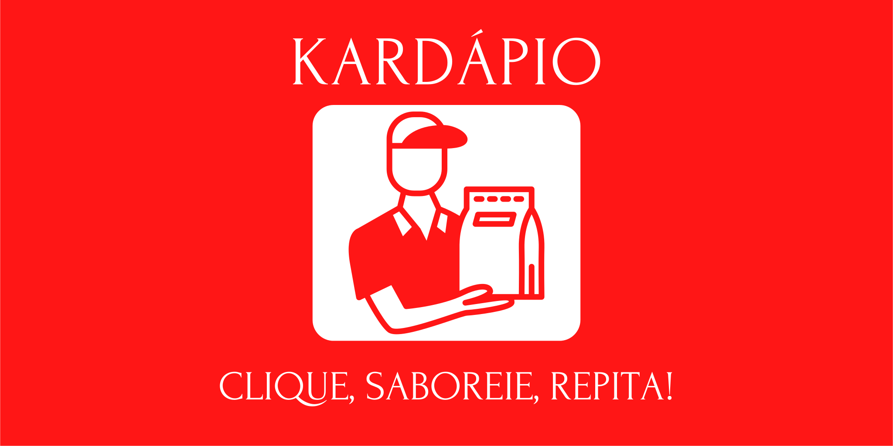
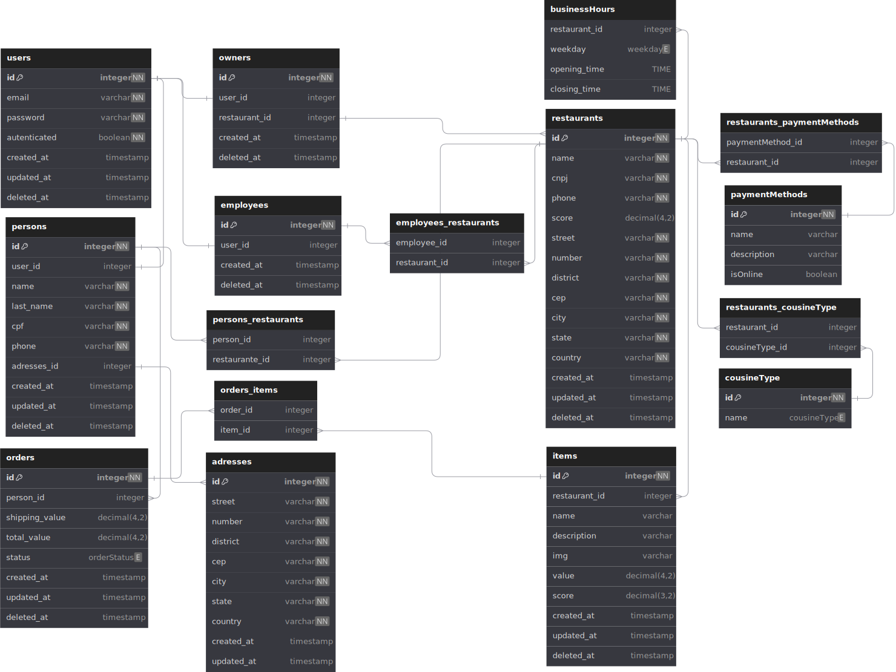

# Kardápio-API

## TO-DO:
- Melhorar este README.md
- Criar CRUD's baseado no atual modelo relacional disponível em: https://dbdiagram.io/d/64b3e96102bd1c4a5e26782e

- Criar front-end ou mobile primeiro? 
- Definir UI/UX

## Sobre o projeto
- Consiste numa API para servir a aplicação Kardápio
- CRUD's básicos, autenticação e regras de negócio

## Como rodar o projeto
### Necessário:
- Java 17
- Docker

### 1. Clone este repositório
### 2. Baixe as dependências através do maven
### 3. Execute o projeto (docker se inicia sozinho)

## Como contribuir

### 1. Faça suas alterações numa branch separada e gere um pull request
### 2. Aguarde seu PR ser analisado
